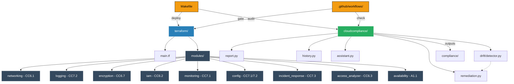

[](https://registry.terraform.io/modules/KADHIRAVANEG/cloudcompliance/aws/latest)
[](https://pypi.org/project/cloudcompliance/)
[](https://pypi.org/project/cloudcompliance/)
[](https://github.com/KADHIRAVANEG/cloudcompliance/pkgs/container/cloudcompliance)


# CloudCompliance — SOC2-Ready AWS IaC

> Infrastructure as Code that provisions a SOC2-aligned AWS security baseline
> with 10 controls and 46 resources — deployable in one command.
> Includes drift detection, AI compliance assistant, score history, auto-remediation and a live dashboard.

## The Problem

Startups spend 6–12 months retrofitting SOC2 controls onto infrastructure that
was never designed to be compliant. Security is an afterthought — CloudTrail
gets enabled after an incident, encryption gets added before an audit, RBAC
gets tightened only when required.

**This IaC eliminates that retrofit entirely.**
Every SOC2 control is provisioned automatically at infrastructure creation time.

> **Scope note:** This IaC implements the *technical infrastructure controls*
> mapped to SOC2 Common Criteria CC6–CC8 and Availability A1. Full SOC2 Type II
> certification additionally requires organizational policies, vendor management,
> employee training, and 6–12 months of evidence collection.

---

## Quick Start

**Requirements:** Python 3.9+, Terraform, Docker

```bash
# 1. Install CLI
pip install cloudcompliance

# 2. Clone the repo
git clone https://github.com/KADHIRAVANEG/cloudcompliance.git
cd cloudcompliance
cp .env.example .env  # add your API keys

# 3. Start everything in one command
bash scripts/start.sh

# Or step by step:
docker run --rm -d -p 4566:4566 localstack/localstack:3.4.0
make deploy
cloudcompliance report
cloudcompliance drift
cloudcompliance serve   # → http://localhost:8080
```

---

## CLI Commands

```bash
# Deploy SOC2 baseline infrastructure
make deploy

# Generate SOC2 compliance evidence report
cloudcompliance report

# Detect infrastructure drift
cloudcompliance drift

# Auto-remediate drift findings
cloudcompliance remediate
cloudcompliance remediate --dry-run    # preview without changes

# View compliance score history (SOC2 Type II evidence)
cloudcompliance history
cloudcompliance history --export       # export JSON for auditors

# Ask AI about your compliance state
cloudcompliance ask "am I ready for a SOC2 audit?"
cloudcompliance ask "what is my biggest security risk?"
cloudcompliance ask "explain CC7.2 and how I implement it"
cloudcompliance ask "what controls am I missing?"

# Open live compliance dashboard
cloudcompliance serve                  # → http://localhost:8080
cloudcompliance serve --port 9090      # custom port
```

---

## Live Dashboard

```bash
cloudcompliance serve
```

Opens a professional dashboard at `http://localhost:8080` showing:

- Real-time compliance score ring
- All 10 SOC2 controls with pass/fail status
- Drift findings with PR links
- Compliance score history chart
- Auto-remediation actions log
- Auto-refreshes every 30 seconds

---

## SOC2 Control Coverage

| Control | Title | Resources Enforced |
|---------|-------|--------------------|
| CC6.1 | Network Isolation | VPC, private subnets, deny-all security group |
| CC6.2 | Authentication Controls | IAM password policy, MFA alert, least-privilege role |
| CC6.3 | Access Revocation | IAM role policies, access analyzer alarms |
| CC6.6 | Transmission Protection | HTTPS-only S3 bucket policy, TLS enforcement |
| CC6.7 | Encryption at Rest | KMS CMK, S3 server-side encryption |
| CC7.1 | Threat Detection | CloudWatch alarms, AWS Config recorder + rules |
| CC7.2 | Audit Logging | Versioned audit bucket, VPC flow logs, Config delivery |
| CC7.3 | Incident Response | Log metric filters, unauthorized API call detection |
| CC8.1 | Change Management | IaC-controlled infra, Config recorder status |
| A1.1 | Availability | S3 versioning, retention policies, backup role |

> **10 controls · 46 AWS resources · 100% compliance score**

---

## What Gets Provisioned (46 resources across 9 modules)

### Networking — CC6.1
- Private VPC (`10.0.0.0/16`) with 2 private subnets
- No public subnets — zero internet exposure by default
- Default-deny security group
- VPC Flow Logs → CloudWatch (90-day retention)

### Logging — CC7.2
- Dedicated audit S3 bucket with versioning
- Delete protection + HTTPS-only policy
- AWS Config delivery channel

### Encryption — CC6.7
- KMS Customer Managed Key with automatic rotation
- S3 encrypted data bucket with KMS SSE
- HTTPS-only bucket policy

### IAM — CC6.2 + CC6.3
- Password policy: 14 chars, complexity, 90-day rotation
- Least-privilege IAM role — S3 read + KMS decrypt only
- Access analyzer role + findings alarm
- SNS topic for root account alerts

### Monitoring — CC7.1
- CloudWatch alarms: root login, public bucket detection
- AWS Config recorder — all resource types
- Config rules: S3 public read prohibited, S3 encryption required, root MFA

### Incident Response — CC7.3
- CloudWatch log group for security events (365-day retention)
- Log metric filters: unauthorized API calls, console sign-in failures
- CloudWatch alarms wired to SNS

### Availability — A1.1
- Versioned availability logs bucket
- Public access blocked
- Backup IAM role

### Config — CC7.1 + CC7.2
- AWS Config recorder + delivery channel
- 3 managed Config rules

### Change Management — CC8.1
- All resources IaC-controlled via Terraform
- Config recorder status tracking
- CI/CD gate on every PR

---

## Auto-Remediation

When drift is detected, CloudCompliance closes the loop automatically:

- **LOW RISK** — patches resources instantly (tags, labels)
- **HIGH RISK** — opens a GitHub PR with exact fix for human review
- **CRITICAL** — alerts immediately with remediation steps

```bash
$ cloudcompliance drift
🟡 HIGH  cloudcompliance-encrypted-data  DELETED

$ cloudcompliance remediate
📋 PR opened: https://github.com/KADHIRAVANEG/cloudcompliance/pull/32
Remediation log saved → compliance/remediation_log.json
```

---

## AI Compliance Assistant

Powered by NVIDIA NIM. Reads your actual tfstate and compliance reports.

```bash
export NVIDIA_API_KEY="your-key"

$ cloudcompliance ask "am I ready for a SOC2 audit?"

> Your compliance score is 100% (10/10 controls passing).
> One drift finding detected: encrypted S3 bucket deleted.
> Recommend: run 'cloudcompliance remediate' to open a fix PR.
```

---

## Compliance Score History

SOC2 Type II requires evidence over time. Every report run is saved automatically.

```bash
$ cloudcompliance history

Date              Score   Controls   Trend
2026-07-01        70%     7/10       —
2026-07-07        90%     9/10       ↑ +20%
2026-07-12        100%    10/10      ↑ +10%

$ cloudcompliance history --export
# Exports history_export.json for auditors
```

---

## Environment Setup

Copy `.env.example` to `.env` and fill in your values:

```bash
cp .env.example .env
```

```bash
# Required for AI assistant
NVIDIA_API_KEY=your-nvidia-nim-key

# Required for auto-remediation PRs
GITHUB_TOKEN=your-github-token
GITHUB_REPO=KADHIRAVANEG/cloudcompliance

# LocalStack endpoint (leave as-is for local dev)
LOCALSTACK_ENDPOINT=http://localhost:4566
```

---

## CI/CD Compliance Gate

Every pull request automatically runs:

1. **Terraform Validate** — format + syntax check
2. **Checkov Security Scan** — 500+ security rules
3. **SOC2 Compliance Check** — deploys to LocalStack, runs report, blocks if score < 100%

---


## Project Structure


```
cloudcompliance/
├── terraform/
│   ├── main.tf
│   ├── variables.tf
│   ├── local.tfvars           # LocalStack config
│   ├── prod.tfvars            # Real AWS config
│   └── modules/
│       ├── networking/        # CC6.1 — VPC, subnets, flow logs
│       ├── logging/           # CC7.2 — Audit bucket
│       ├── encryption/        # CC6.7 — KMS, encrypted S3
│       ├── iam/               # CC6.2 — Password policy, roles
│       ├── monitoring/        # CC7.1 — CloudWatch alarms
│       ├── config/            # CC7.1 + CC7.2 — Config rules
│       ├── incident_response/ # CC7.3 — Log metric filters
│       ├── access_analyzer/   # CC6.3 — IAM access analyzer
│       └── availability/      # A1.1 — Versioning, backup
├── cloudcompliance/
│   ├── report.py              # SOC2 evidence generator + CLI
│   ├── history.py             # Score timeline (SQLite)
│   ├── assistant.py           # AI compliance assistant (NVIDIA NIM)
│   ├── dashboard.py           # Live dashboard (FastAPI)
│   ├── drift/
│   │   └── detector.py        # Drift detection engine
│   └── remediation.py         # Auto-remediation engine
├── compliance/                # Generated reports
│   ├── compliance_report.json
│   ├── compliance_report.md
│   ├── drift_report.json
│   ├── remediation_log.json
│   ├── history.db
│   └── history_export.json
├── docs/                      # Project website (GitHub Pages)
├── scripts/
│   └── start.sh               # One-command startup
├── .github/workflows/         # CI/CD gate
├── .env.example               # Environment variables template
└── Makefile
```

## Chart 


---

## Makefile Commands

```bash
make start          # Start LocalStack + deploy + report + dashboard
make deploy         # Deploy all SOC2 controls to LocalStack
make deploy-prod    # Deploy to real AWS
make validate       # Terraform format + validate
make report         # Generate SOC2 evidence report
make drift          # Run drift detection
make history        # Show score history
make history-export # Export audit evidence JSON
make remediate      # Auto-remediate drift findings
make remediate-dry  # Preview remediation without changes
make serve          # Open live dashboard at :8080
make destroy        # Tear down all infrastructure
make all            # deploy + report + drift + history
```

---

## Use as a Terraform Module

```hcl
module "soc2_baseline" {
  source  = "KADHIRAVANEG/cloudcompliance/aws"
  version = "1.5.0"

  project_name = "my-startup"
  environment  = "prod"
  aws_region   = "us-east-1"
}
```

---

## Install Options

```bash
# Python CLI (recommended)
pip install cloudcompliance

# Docker
docker pull ghcr.io/kadhiravaneg/cloudcompliance:latest
docker run -v ~/cloudcompliance/terraform:/app/terraform \
  ghcr.io/kadhiravaneg/cloudcompliance:latest

# Terraform Registry
source  = "KADHIRAVANEG/cloudcompliance/aws"
version = "1.5.0"
```

---

## LocalStack vs Real AWS

| Feature | LocalStack (free) | Real AWS |
|---------|-------------------|----------|
| VPC / Subnets | ✅ | ✅ |
| S3 + Encryption | ✅ | ✅ |
| KMS | ✅ | ✅ |
| IAM | ✅ | ✅ |
| CloudWatch | ✅ | ✅ |
| AWS Config | ✅ | ✅ |
| SNS | ✅ | ✅ |
| CloudTrail | ⚠️ Pro only | ✅ |
| GuardDuty | ⚠️ Pro only | ✅ |

---

## Standards Referenced

- [AICPA SOC2 Trust Services Criteria 2017](https://www.aicpa.org)
- [CIS AWS Foundations Benchmark v2.0](https://www.cisecurity.org)
- [NIST SP 800-53 Rev 5](https://nvlpubs.nist.gov)
- [AWS Security Reference Architecture](https://docs.aws.amazon.com/prescriptive-guidance)

---

## Tech Stack

`Terraform` · `Python` · `FastAPI` · `AWS` · `LocalStack` · `GitHub Actions` · `NVIDIA NIM` · `SQLite` · `KMS` · `IAM` · `CloudWatch` · `SNS` · `AWS Config`

---

## Changelog

| Version | What's new |
|---------|-----------|
| v1.5.0 | Live dashboard — `cloudcompliance serve` |
| v1.4.0 | Auto-remediation — GitHub PR for high-risk drift |
| v1.3.0 | Compliance score history — SOC2 Type II evidence |
| v1.2.0 | Drift detection — `cloudcompliance drift` |
| v1.1.0 | 10 SOC2 controls, 46 resources, markdown reports |
| v1.0.0 | Initial release — SOC2 baseline IaC |

---

## Author

**Kadhiravan E.G.** — Cybersecurity student  
GitHub: [@KADHIRAVANEG](https://github.com/KADHIRAVANEG)  
Website: [CloudCompliance](https://kadhiravaneg.github.io/cloudcompliance)
